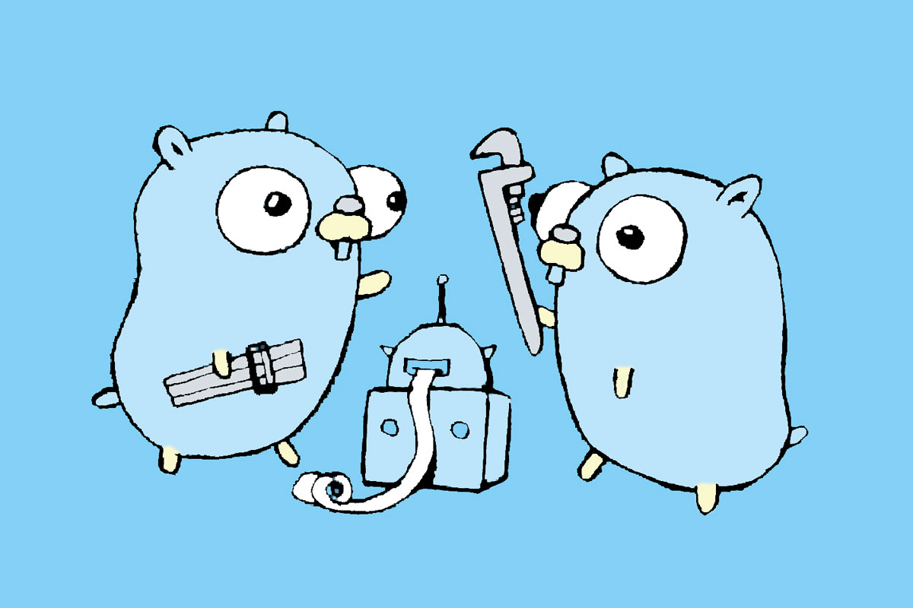

theme: simple, 3

#Digital Publishing for Scale

##The Economist and Go

###Jonas
###Lead Engineer, Content Platform 

---
#Print Pressing Forward


^When I tell people that I work for The Economist, they assume I'm some kind of economics or stats person and my work is a little something like this. Then I tell them I'm a Lead Engineer for the Content Platform and program primarily with Go and I get a surprised reaction. That's because for a long time, The Economist with primarily concerned with print.

---

#Print Pressing Forward


^I'm going to assume however, in a room full how technologists, that's not how most of us read the news any more. Share of hands, who still prefers to read their news in print? And how about online or mobile? The Economist, like most publishers, realized they needed to modernize and digitize in order to keep reaching our readers, and that's when I jumped into the picture

---

[.background-color: #ffffff]


^I joined The Economist to take part in a project that would reshape our technology stack and modernize it in order to better support the digital distribution of content. At that time,  content was being authored and displayed in a Monolithic Drupal CMS. For those less familiar with Drupal, it was a one-in-all solution primarily using PHP, MySQL, JS, and then CSS and HTML for design.  Our goal was to break up the monolith and develop a platform that consumed content, standardized it, and delivered it via an API. This platform would be hosted in AWS, use Docker containers, and be written primarily in Go.

---

#The Happy Path to Go

**The Platform**
* AWS hosted
* Event Messaging
* Worker microservices
* Distributed
* S3, DynamoDB, and ElasticSearch data storage
* RESTful API & GraphQL

^So why did we choose Go? Well first, it's helpful to understand the overall architecture for the new system. The Content Platform is a event based system. It responds to events from our different content authoring platforms and triggers a stream of processes run in discrete worker miscroservices. These services perform functions such as data standardization, semantic tagging analysis, indexing in our ElasticSearch database, formatting and pushing content to external platforms like apple news or facebook, and much more. We also have a RESTful API, which combined with GrahpQL, is used to query content, and this is how our products, such as the website and mobile apps, fetch content to be displayed.

---
#The Happy Path to Go

**Key factors**
* Built in concurrency support enables performance at scale
* Strong networking and API support
* Compiled language simple to deploy across platforms
* Simple design and syntax quickly enables developers

^Understanding the type of architecture we were aiming for, we then had to find the right language for our Worker microservices. Go was compared against Python, Ruby, Node, PHP, and Java. While every language had its strengths , Go fit best with our architecture and use cases. Go's baked in concurrency and apis and it's design as a static, compiled language would enable a distributed, eventing systems that could scale quickly. Additionally, the relatively simple syntax of Go made it easy to pick up and start writing working code, which was a quick win for a team going through so much technology transition. Overall, Go was a language developed for usability and efficiency in a distributed, cloud driven world.

---

#Fail Fast: Language Design

**Application Principles**
* Minimize startup time
* Fail fast
* Continuous Integration & Delivery

^To dive in a little further, I want to share a few examples of where Go fit our needs. Failing Fast was a critical part of our system since we were working with distributed, independent services. Aligning with the Twelve Factor App principals, we wanted to be sure we could start quickly and fail quickly. Go's design as a static, compiled language enables fast start up times and the performance of the compiler has continually improved and never been an issue for us. Additionally, the Go error handling design allowed us to not only fail faster, but fail smarter.

---

#Fail Fast: Errors vs Exceptions

**Errors vs Exception**
* No exceptions
* Error as a type
* Failing fast the responsibility of the developer

^A major difference people quickly notice in Go is that is does not have exceptions, rather it has an Error Type. 

---

# Fail Fast: Error Handling

```go
type error interface {
    Error() string
}

// New returns an error that formats as the given text.
func New(text string) error {
	return &errorString{text}
}

// errorString is a trivial implementation of error.
type errorString struct {
    s string
}

func (e *errorString) Error() string {
    return e.s
}

```

^Let's introduce the error type. In Go, all errors are values. The Error type is predeclared and is an interface, which you see in the first block above. I won't spend too much time on Go interfaces in this talk, but essentially it is a named collection of methods and any other custom type can satisfy the interface if it has those same methods. So the error type is an interface that can describe itself with a string. So by added an Error method that returns a string, you can easily create custom errors and you generate them like with the New function above, which comes from the errors package.

---

#Fail Fast: Error Handling

```go, [.highlight: 3-5]
func fetchContent(id string) (string, error) {
    content, err := fetch(id)
    if err != nil {
    	// handle the error.
	}
	// happy path continues.
}

```

^So what does this mean in practice? In Go, functions allow multiple return values, so if your function or method can fail, it will likely return an error value. The language encourages you to explicitly check for errors where they occur, so you code will frequently have this "if err != nil" check.

---

#Fail Fast: Error Handling

```go
package net

type Error interface {
    error
    Timeout() bool   // Is the error a timeout?
    Temporary() bool // Is the error temporary?
}

if nerr, ok := err.(net.Error); ok && nerr.Temporary() {
    time.Sleep(1e9)
    continue
}

if err != nil {
    log.Fatal(err)
}
```

[^1]: From [Error Handling in Go](https://blog.golang.org/error-handling-and-go).

^This frequent error handling can seem repetitive at first. However, the Go authors argue that not all exceptions are exceptional meaning that not all errors should crash your application. If you can gracefully recover from an error, you should do so. Error as a value enables you to use the error to simplify your error handling. In a distributed  system for example, we can easily enable retries by wrapping our errors. Network issues are always going to be encountered in our system, whether we're sending data to other internal services or pushing to third party tools. This example from the Go Blog highlights how we can take advantage of error as a type to build in retries and eventual backoffs into our system, so that we don't fail on minor, temporary disruptions. We've used similar error wrapping for handling HTTP errors and better using HTTP status code to communicate the type of errors to clients.

---

#Consistency: Language Design

**The Canonical Article**
* Standard data model for all content
* Aligned to schema.org standards
* Hypermedia references to associated content
* Query via GraphQL and RESTful API

^Another critical factor in our applications is consistency. At The Economist content is king. Every product and consumer needs consistency from our API. Our products primarily use GraphQL to query our API, which uses a static schema and our distributed services are applying logic based on content specific data. Thus it's critical that we delivered our content consistently. A static language helps us enforce this from the was an easy win in helping ensure our data was consistent.

---

#Consistency: Testing

main.go

```go
package main

func Sum(x int, y int) int {
	return x + y
}

```

^The next feature that improved our consistency was Go's testing package. Go's fast compile times combined with testing as a first class feature enabled us to embed strong testing practices into our workflows and quick failures in our build pipelines. Let's take a quick look at testing in Go by reviewing a test for this Sum function.

---

#Consistency: Testing

main_test.go

```go
package main

import "testing"

func testSum(t *testing.T) {
	total := Sum(1,2)
	if total != 3 {
		t.Errorf("Sum incorrect, got: %d, want: %d.", total, 3)
	}
}

```

^To create a test for this code, I simply created a file with the same  package name and append underscore "test" to the file name. My test file imports the standard library testing package. All tests are functions that take a pointer to a T type that manages the test state and ensures the function is run when the "go test" command is run. From there you write the test that verifies the function runs as expected. 

---

#Consistency: Testing

**Go Test Features**
* Cover: Code test coverage
* Bench: Runs benchmark tests (Benchxxx)
* TestMain: Add extra setup or teardown for tests
* Table tests and mocks

^The Go Tooling for tests makes them easy setup and run. Running "go test" will run the tests in the current directory. Additionally the test command has several helpful feature flags. The "cover" flag  provides a detailed report on code coverage, which is a helpful tool for you development process. The "bench" test runs benchmark tests with are denoted by starting with the word Bench rather than test. The TestMain function allows extra setup for test, such as a mock metadata or authentication server. Additionally, Go makes it quite easy to use table test with anonymous structs and mocks with interfaces, making your tests more robust. So while testing is nothing new, Go makes it easy to write robust tests and then embed them seamlessly into your workflow. From the start we were able to run tests are part of our build pipelines with no special customization and we've event added githooks to runs tests before pushing code to Github. 

---

#Consistency: The Challenges

One moment an empty value is 0.

```
{
	"id": "test123",
	"type": "article",
	"ukOnly": 0
}
```

The next moment it's an empty string!

```
{
	"id": "test123",
	"type": "article",
	"ukOnly": ""
}
```

^However, we weren't without our challenges in acheiving consistency with Go. One of the first major challenges for our platform was managing dynamic content from unpredictable backends. We consume content from source CMS systems primarily via JSON endpoints, but we couldn't guarantee the data types would be consistent. This meant we couldn't easily use Go's encoding/json package, which supports unmarshalling JSON into structs, but panics if the types do not match. To overcome this challenge, we needed a custom way to map our backends to a standard format. Ater a few iterations on the approach, we decided to implement a custom unmarshalling process. In some ways, this felt a bit like rebuilding the a standard lib package, but it gave us fine grained control of how we handled source data. 

---

#Consistency: Serializing Dynamic Content

```go
package json

// decodeState represents the state while decoding a JSON value.
type decodeState struct {
	data         []byte
	off          int // next read offset in data
	opcode       int // last read result
	scan         scanner
	errorContext struct { // provides context for type errors
		Struct string
		Field  string
	}
	savedError            error
	useNumber             bool
	disallowUnknownFields bool
}

```
^Above is a snippet of the approach in Go's encoding JSON library. Struct for managing the state when decoding the JSON.

---

#Consistency: Serializing Dynamic Content

```go
func (d *decodeState) value(v reflect.Value) error {
	case scanBeginArray:
		if v.IsValid() {
			if err := d.array(v); err != nil {
				return err
			}
		} else {
			d.skip()
		}
		d.scanNext()
	case scanBeginObject:
		if v.IsValid() {
			if err := d.object(v); err != nil {
				return err
			}
		} else {
			d.skip()
		}
		d.scanNext()
	return nil
}

```
^Using the reflection.Value object to assert the type of the data. Note that reflection in Go has a relatively limited use case compared to some other langauges. The reflect package implements run-time reflection, allowing a program to manipulate objects with arbitrary types. The typical use is to take a value with static type interface{} and extract its dynamic type information by calling TypeOf, which returns a Type.

---

#Consistency: Serializing Dynamic Content

```go
// convertNumber converts the number literal s to a float64 or a Number
// depending on the setting of d.useNumber.
func (d *decodeState) convertNumber(s string) (interface{}, error) {
	if d.useNumber {
		return Number(s), nil
	}
	f, err := strconv.ParseFloat(s, 64)
	if err != nil {
		return nil, &UnmarshalTypeError{Value: "number " + s, Type: reflect.TypeOf(0.0), Offset: int64(d.off)}
	}
	return f, nil
}
```
^Once we know the type, convert to the correct value.

---

#Consistency: Serializing Dynamic Content

```go
package canonical

// traverseState represents current state of tree traversal.
type traverseState struct {
	object   *s3.Object
	tags     *traverseTags
	field    reflect.StructField
	treePath string
}

```
^This is a snippet of our own approach, which follows the same basic steps as the Go library, however it allowes us to decide when to apply defaults if we had invalid data and when to error and still takes advantage of the existing functionality in the Go standard lib. Object to represent the current state of our traversal.

---

#Consistency: Serializing Dynamic Content

```go
// traverse is a top level tree traversal function.
func (t traverseState) traverse(v reflect.Value) {
	switch v.Kind() {
	case reflect.Struct:
		switch {
		case t.field.Tag.Get(refTag) != "":
			t.setRef(v)
		default:
			t.traverseStruct(v)
		}
	case reflect.Slice:
		if t.field.Tag.Get(pathTag) != "" {
			t.setSlice(v)
		}
	case reflect.String, reflect.Bool, reflect.Int, reflect.Float64:
		if t.field.Tag.Get(pathTag) != "" {
			t.setPrimitive(v)
		}
	default:
		logger.Warnln("Unknown kind:", v)
	}
}

```
^Use reflection.Value to determine the items type.

---

#Consistency: Serializing Dynamic Content

```go
func toInt(r gjson.Result) int64 {
	if !r.Exists() {
		return 0
	}
	switch r.Type {
	case gjson.True, gjson.False, gjson.String, gjson.Number:
		return r.Int()
	default:
		return 0
	}
}
```
^Convert to the correct value.

---

#Consistency: Serializing Dynamic Content

```
BenchmarkCustomSerializer-1   	    1000	   1345080 ns/op
BenchmarkCustomSerializer-2   	    1000	   1410146 ns/op
BenchmarkCustomSerializer-3   	    1000	   1348061 ns/op
BenchmarkCustomSerializer-4   	    1000	   1343668 ns/op
BenchmarkCustomSerializer-5   	    1000	   1411710 ns/op

BenchmarkStandardUnmarshal-1   	    1000	   1451230 ns/op
BenchmarkStandardUnmarshal-2   	    1000	   1771896 ns/op
BenchmarkStandardUnmarshal-3   	    1000	   1396645 ns/op
BenchmarkStandardUnmarshal-4   	    1000	   1720717 ns/op
BenchmarkStandardUnmarshal-5   	    1000	   1475672 ns/op

```

^As you can see in this first set of metrics, our custom unmarshalling tool performs at gererally the same rate as a previous iteration with the standard JSON library. What this highlights is that while the approach is a bit heavy handed in the implementation, interfaces and reflectioned worked well to acheive our goals and didn't prevent us from scaling. This may not be the right approach for every situation, but it's helped us quickly provide stardized, consistent data to our consumers.

---

# Scale: HTTP and concurrency

```go
package main

import (
    "fmt"
    "log"
    "net/http"
)

func handler(w http.ResponseWriter, r *http.Request) {
    fmt.Fprintf(w, "Hello World!")
}

func main() {
    http.HandleFunc("/", handler)
    log.Fatal(http.ListenAndServe(":8080", nil))
}

```

^Part of this scaling was also enable with the strong support for networking and APIs in Go. In Go, you can quickly implement scalable http endpoints with no frameworks needed. In this example you can see I've imported the net/http package and setup a handler, with takes an request and response writer. You can access request information such as the url in the Request object and write to the response write to send back a request. When we first started, we were using a framework, but eventually went back to just using the standard lib as it had a lot more than we needed. Go was able to meet all of our networking needs.

---

# Scale: HTTP and concurrency

```go, [.highlight: 1, 21]
func (srv *Server) Serve(l net.Listener) error {
	baseCtx := context.Background() // base is always background, per Issue 16220
	ctx := context.WithValue(baseCtx, ServerContextKey, srv)
	for {
		rw, e := l.Accept()
		if e != nil {
			select {
			case <-srv.getDoneChan():
				return ErrServerClosed
			default:
			}
			if ne, ok := e.(net.Error); ok && ne.Temporary() {
				// delay handling.
				continue
			}
			return e
		}
		tempDelay = 0
		c := srv.newConn(rw)
		c.setState(c.rwc, StateNew) // before Serve can return
		go c.serve(ctx)
	}
}
```

^These endpoints can scale because each request on a handler is a goroutine, baked in, no customization needed. The Serve function here from the net/http library is called when requested are recieved on the Listener, like I setup in the example before. And at the end you can see the "go" keyword before the request is served, meaning each request is processed in it's own go routine. A goroutine is a lightweight thread managed by the Go runtime. I'll talk about this a bit more as we address the next issue of scale our system encountered.

---

# Scale: Content Guarantees

## CAP Theorum

**Pick two**
* Consistency
* Availiabity
* Partition Tolerance

[^1]: [Go Concurrency Patterns](https://www.youtube.com/watch?v=f6kdp27TYZs).
[^2]: [Understanding Channels](https://www.youtube.com/watch?v=KBZlN0izeiY).

^Working with distributed data means wrestling with the gaurantees we promise consumers. As per the CAP theorem, it is impossible to simultaneously provide more than two out of the following three guarantees: Consistency. Availability. Partition tolerance. In our platform, we chose Eventual Consistency, meaning that we guarentee reads from our data sources will eventually be consistent, we tolerate moderate delays in all data sources reaching a consistent state. One of the ways we minimize that gap is by taking advantage of Goroutines. As I meantioned, Goroutines are essentially green threads. They're lightweight, and managed by the Go runtime to prevent thread exhaustion. There are some great talks I linked here that go more in depth if you're interested.

---

#Scale: Content Guarantees

```go
func reprocess(searchResult *http.Response) (int, error) {
	responses := make([]response, len(searchResult.Hits.Hits))	
	var wg sync.WaitGroup
	wg.Add(len(responses))
	
	for i, hit := range searchResult.Hits.Hits {
		wg.Add(1)
		go func(i int, item elastic.SearchHit) {
			defer wg.Done()
			code, err := reprocessItem(item)
			responses[i].code = code
			responses[i].err = err
		}(i, *hit)
	}
	wg.Wait

	return http.StatusOK, nil
}
```

^One of the data sources in our system in Elasticsearch. When content is updated in the system, one of our processes is to be sure that all content referencing that item is updated and reindexed. With Goroutines we can improve the time it takes run this reprocessing, thus ensuring the items are all consisten faster. In the example above you can see that after querying all the items that need reprocessing, we run each reprocess event in a goroutine.

----

#Scale: Content Guarantees

```
ProcessTimeAsync-1   	    20	   564.030301ms
ProcessTimeAsync-2   	    20	   813.193206ms
ProcessTimeAsync-3   	    20	   564.536223ms
ProcessTimeAsync-4   	    20	   830.068246ms
ProcessTimeAsync-5   	    20	   865.895741ms

ProcessTimeSync-1   	    20	   3.806562215s
ProcessTimeSync-2   	    20	   4.666270193s
ProcessTimeSync-3   	    20	   4.206750535s
ProcessTimeSync-4   	    20	   3.745507495s
ProcessTimeSync-5   	    20	   4.109966063s
```

^This is a somewhat oversimplified example of the performance differences when I run this reindexing process procedurally vs asyncronsly with Goroutines. The improvements are not insignificant and in a distributed systems with 1 content change triggering hundreds of events, these improvements add up and have enables use to reach a consistent state with minimal impact or delay for consumers.

---

# Scale: Visibility with Profiling

**PPROF**
* CPU profiles, traces, heap profiles, and mutex profiles.
* CLI tool
* HTTP Endpoint
* Visualizations

^Go has many tools that make it easy to have visibility into your applications, and these are especially helpful as you start focusing on your system's preformance and using more advanced features like GoRoutines and Channels. One of the more powerful tools is PPROF, which collects CPU profiles, traces, heap profiles, and mutex profiles and exposes these on a port. These metrics can also be interactively viewed in the command line, or exported into visualizations. I've used PPROF both to understand the performance of my application and to debug the application when I've encountered issues like memory leaks. This is another example of where Go provides these advanced tools right out of the box. I can immediately start using this during my programing.

---

# Scale: Dependencies

##go get


^In you you can easily import 3rd packages via the "go get" command. The files are stored in you GOPATH and works well for internal dependencies. Dependencies are statically linked and compiled alongside your application's code into the single application binary. This is helpful with distributed systems because it limits the complexity in installing and associating dependencies. It's made it easier for us to scale services as needed and add new services without cimplicated build processes.

---

# Scale: Dependencies

##go where?


^When go was released it had no dependencies management system. Within the community several tools were developed to meet this need. Within our own systems, we used Git Submodules. This made sense at the time as the community was actively pushing for a standard dependency management tool, and so we wanted to use a non-Go tool until the chosen tool arrived. It's been 2 years and while the community is closer to an aligned approach and tool for dependency management, it's not there yet. At The Economist, we've had minimal issues with our current approach, and so it hasn't posed specific challenges for us, but it certianly has been challnging for others and it something to be aware when transitioning to Go. 

---

# Embracing Limitations


^When we design systems it's more than just programming and we have to understand what works where and when. Wrap up where Go and good and where other lanugages are better. 

---

# Embracing Limitations: Metadata Parsing

```go
// runExif runs the exiftool command with a set of arguments.
func runExif(args []string) ([]byte, error) {
	cmdOut, err := exec.Command("exiftool", args...).Output()
	if err != nil {
		return nil, err
	}
	return cmdOut, nil
}
```

^Limited tools for metadata extraction which we encountered when processing audio files. Ultimately we relied on Python's Exiftool. Our services run in docker containers, so we were able to include installing Exiftool and running it from our Go program. Hopeful that we can add functionality to the Go libs

---

# Embracing Limitations: HTML Maddness


```html
<br><em>• Percentage change: shows the change in 
inflation-adjusted prices between two selected dates</em></p>
<p><em><span class="fontcolor-red"><span class="fontcolor-red">
<span class="fontcolor-black"><span class="fontcolor-red">
We also publish interactive house-price guides to</span>
&nbsp;</span><a href="\"http://www.economist.com/houseprices\&quot;">global markets</a></span>
&nbsp;<span class="fontcolor-red">and&nbsp;</span>
<em><span class="fontcolor-red"><span class="fontcolor-red">
<span class="fontcolor-black"><a href="http://www.economist.com/blogs/graphicdetail/2014/04/british-house-prices">British regions</a>.
</span></span></span></em></span></em></p>
```

^Handling messy, broken HTML gracefully. Had to use JS.

---

# Embracing Limitations: Simple JSON handling

```javascript
// getLane returns lane information from the
// envelope. It uses jsonpointer to access the field
// as we want to build on this in a subsequent iteration.
const getLane = (event) => {
  const target = '/envelope/responseElements/queue-source';
  return pointer.has(event, target) && pointer.get(event, target);
}

```
^The way we filter messages through our event driven system is primarily with AWS lambdas. These are meant to be light weight function spun up only when called. Once use case is to filteres our events into different lanes, we have fast and slow lanes for events that are live in the system verse reprocessing or reindexing we periodically need. This filtering is done based on a single metadata field. AWS not does support Go lambdas, and we have some use cases of that, but primarily for simple filters on event messages, Node is easier. In this example, you see we can take advantage of the javascript JSON pointer package to easily grab an element in a JSON object with the full unmarshalling that would be required with Go. Here it was easier for our devs and allowed smaller code in our Lambdas by sticking with JS.

---

# Key Takeaways: Performance

Single node: 60 seconds, 380 rps - 100% success - 3.5ms latency

```
./testTwo.sh six 60 380
Requests [total, rate] 18000, 300.02
Duration [total, attack, wait] 1m0.000150762s, 59.996660501s, 3.490261ms
Latencies [mean, 50, 95, 99, max] 3.463947ms, 3.419128ms, 3.725858ms, 4.210743ms, 11.936912ms
Bytes In [total, mean] 1119096000, 62172.00
Bytes Out [total, mean] 0, 0.00
Success [ratio] 100.00%
Status Codes [code:count] 200:18000
```

---

# Key Takeaways: Performance

Full stack: 60 seconds, 600 rps - 100% success - 18ms latency

```
./testTwo.sh six 60 600
Requests [total, rate] 36000, 600.02
Duration [total, attack, wait] 1m0.064912748s, 59.998309171s, 66.603577ms
Latencies [mean, 50, 95, 99, max] 17.773203ms, 11.960915ms, 48.500723ms, 68.346101ms, 265.309926ms
Bytes In [total, mean] 180513393, 5014.26
Bytes Out [total, mean] 0, 0.00
Success [ratio] 100.00%
Status Codes [code:count] 200:36000
```

^Go has generally worked well for us and we enjoy writing it. Following tests were run to validate the level of concurrent requests we could handle prior to a new product launch.

---

# Key Takeaways: Scale

//To Do: Lamaar screen shot.

^The new product was our mobile app, a huge upgrade from our existing digital paper experience. Our mobile team was easily able to work with our API and we were able to quickly iterate and add new features as user groups and feedback was gathered. It's one of the fasted product launches we've had. Partially on this success, we're running an AMP project, with AMP pages built using our API as the backend, and developers on all teams are able to move quickly and rapidly release to market.

---

# Key Takeaways: Design

**Systems Design**
* What are your system goals?
* What guarantees are you providing your consumers?
* What architecture and patterns are right for your system?
* How will your system need to scale?

^Sometimes it's not always the right tool, and that's fine. We have a polyglot platform and use different languages where it makes sense. Go is liekly never going to be our top choice when we have to mess around with a lot of text and dynamic content, so we keep Node in our toolset. But Go's strengths are the backbone that allows are systems to scale quickly. We know it's the tool to turn to when we're adding new features and delivering to new products and it's made our development team a family of happy Gophers.

---

#Thank You!
##Jonas
###@yigenana

